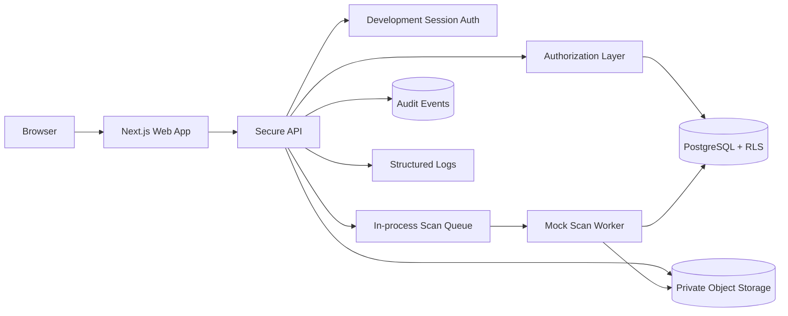
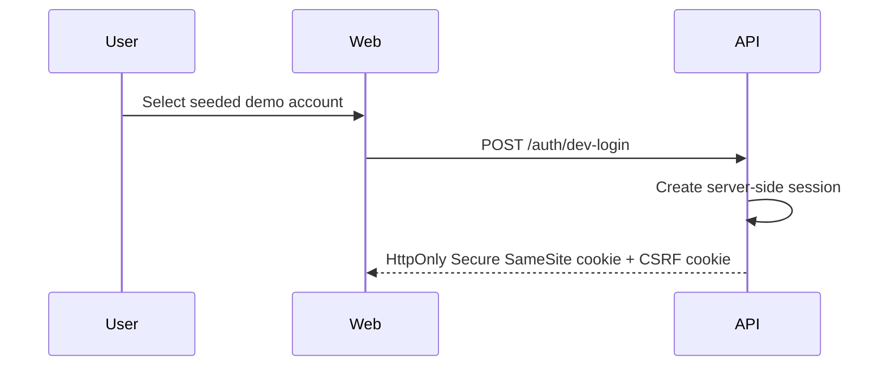
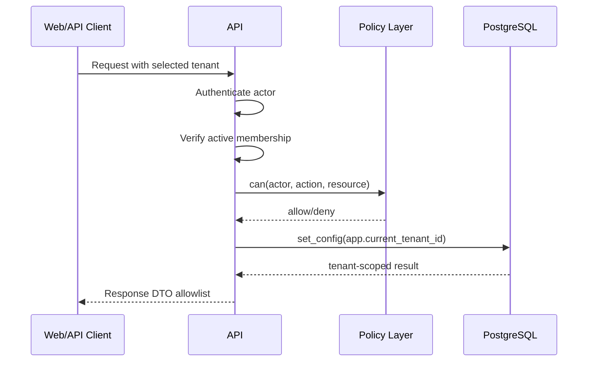
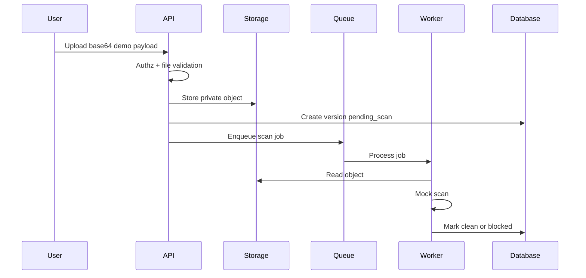

# Architecture

## Context

TrustVault Lite is a portfolio demo for a secure multi-tenant evidence portal. The implemented local architecture uses a Next.js web app, a TypeScript API, PostgreSQL with RLS for database-backed tests, private object storage abstractions, an in-process scan queue/worker, audit events, and CI security workflows.

Production identity is intentionally not implemented in this demo. The production path is OIDC Authorization Code Flow with MFA or passkeys through an external identity provider.

## Implemented Component Diagram

## Production Extension Points

The codebase includes explicit boundaries for production-grade components without claiming they are wired in the local demo:

- OIDC provider for production authentication.
- Redis-compatible rate limiter adapter for multi-instance rate limits.
- S3/MinIO-compatible storage adapter.
- ClamAV or equivalent scanner behind the scan worker boundary.

## Demo Auth Flow

The `/auth/dev-login` endpoint is disabled in production mode.

## Tenant Request Flow

## Upload Flow

## Download Flow

1. Actor requests download metadata or proxy file content.
2. API authenticates the actor or validates the public share token.
3. API verifies tenant, role, project, share-link state, and scan status.
4. API refuses files that are not `clean`.
5. API streams clean content through a proxy endpoint without exposing storage keys.
6. API writes an audit event.

## Data Model

Main tables:

- `users`
- `tenants`
- `memberships`
- `projects`
- `documents`
- `document_versions`
- `share_links`
- `api_keys`
- `audit_events`
## Browser Hardening

Implemented headers:

- `Content-Security-Policy`
- `Strict-Transport-Security` in production web responses
- `X-Content-Type-Options: nosniff`
- `X-Frame-Options: DENY`
- `Referrer-Policy: strict-origin-when-cross-origin`
- `Permissions-Policy`
