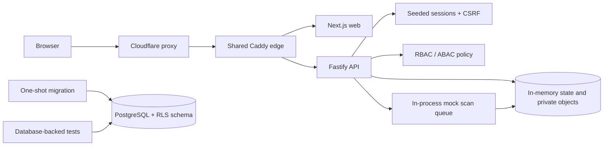
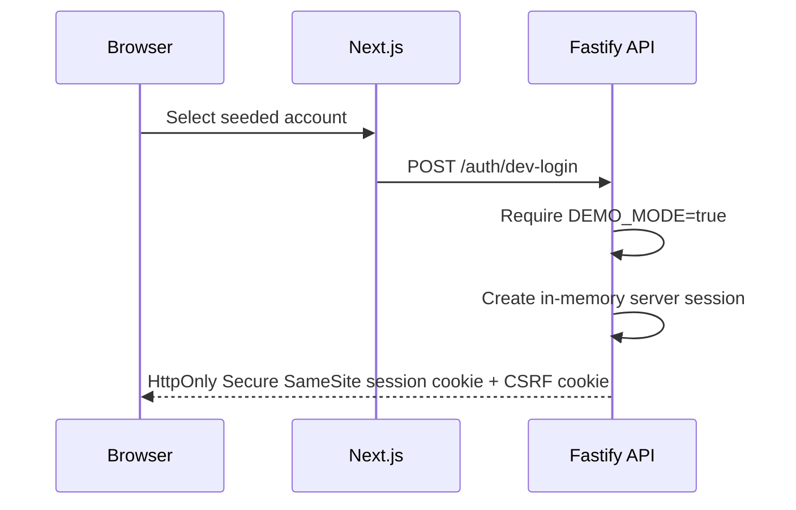
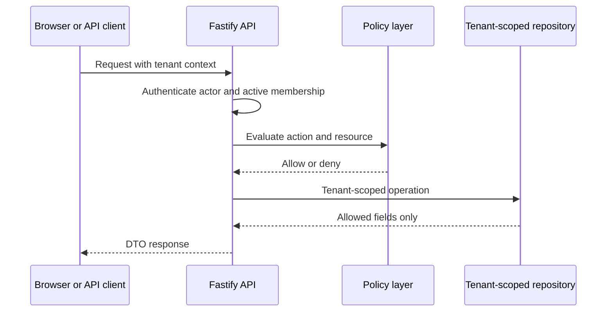

# Architecture

## Runtime scope

TrustVault Lite is a controlled, synthetic portfolio sandbox. The live request path is Cloudflare, the shared Caddy edge, Next.js or Fastify, and one API instance. The API process uses in-memory adapters for sessions, rate limits, projects, documents, object content, scan jobs, share links, API keys, and audit events. Restarting the API resets that state.

PostgreSQL runs on the home-server stack so migrations and the least-privileged application role are validated. PostgreSQL repositories and RLS policies are implemented and exercised by database-backed tests, but `server.ts` currently starts `buildApp()` with its default in-memory repositories. PostgreSQL must therefore not be described as the live sandbox's durable business-data store.

## Live component diagram

Only Caddy publishes host ports 80/443. Web and API expose ports only to Docker networks; PostgreSQL is attached only to the internal data network. Caddy blocks public `/api/internal/*` routes and sends `/api/*` to Fastify after stripping the `/api` prefix.

Fastify trusts exactly one proxy hop: Caddy. Because Cloudflare currently precedes Caddy, reliable end-user IP attribution additionally requires Caddy to trust only Cloudflare's published ranges with strict parsing and requires direct-origin access to be restricted. DNS-only operation removes that extra trust boundary.

## Authentication and session flow

`DEMO_MODE` is independent from `NODE_ENV`. In production the seeded login returns `404` unless `DEMO_MODE=true`. The public sandbox also returns `404` for organization and invitation creation. No real passwords, customer identities, or customer data are supported.

## Tenant request flow

In the live sandbox `R` is an in-memory repository. In database-backed tests it is a PostgreSQL repository that sets `app.current_tenant_id` so RLS provides defense in depth. Application authorization remains mandatory in both modes.

## Synthetic upload and scan flow

1. An authenticated actor submits a base64 JSON PDF payload.
2. The API checks tenant authorization, request shape, extension, MIME type, PDF magic bytes, and size.
3. The private in-memory storage adapter stores the object and the version enters `pending_scan`.
4. The API queues an in-process tenant-scoped scan job.
5. The browser calls the authenticated document scan action; it never receives the internal worker token.
6. The mock scanner marks known demo malware markers as `blocked` and other valid demo content as `clean`.
7. Only clean versions can be downloaded through authenticated or public proxy endpoints.

This demonstrates the control boundary, not real malware detection. Multipart transport, durable object storage, and ClamAV are not implemented.

## Implemented data model path

The migration and PostgreSQL repositories cover `users`, `tenants`, `memberships`, `projects`, `documents`, `document_versions`, `share_links`, `api_keys`, and `audit_events`. Their RLS behavior is verified in CI. The live sandbox keeps corresponding domain records in memory.

## Extension points, not runtime components

- OIDC Authorization Code Flow with MFA or passkeys;
- Redis-compatible durable/distributed rate limiting;
- S3/MinIO-compatible private object storage;
- ClamAV or another real malware scanner;
- multipart or presigned upload transport;
- durable sessions, queues, audit storage, and multi-instance operation.

## Browser and edge hardening

- same-origin web and API publication;
- CSP, HSTS, `nosniff`, frame denial, referrer policy, and permissions policy;
- secure cookies plus origin and CSRF validation for mutating session requests;
- validated production origin and strict demo-mode configuration;
- request-body limits, stable errors, log redaction, and proxy-aware rate limits;
- no public API, web, PostgreSQL, Docker daemon, or Caddy admin ports beyond the shared edge.
